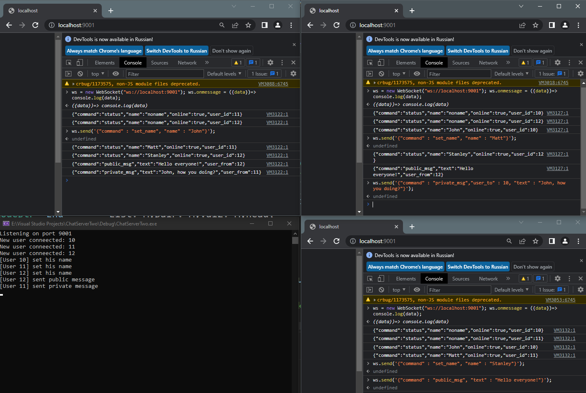

# Chat server app

Simple chat server app with µWebSockets

## Tech

- [nlohmann JSON](https://github.com/nlohmann/json)
- [uWebSockets](https://github.com/uNetworking/uWebSockets)

## Requirements

- C++ 20 compatitable compiler